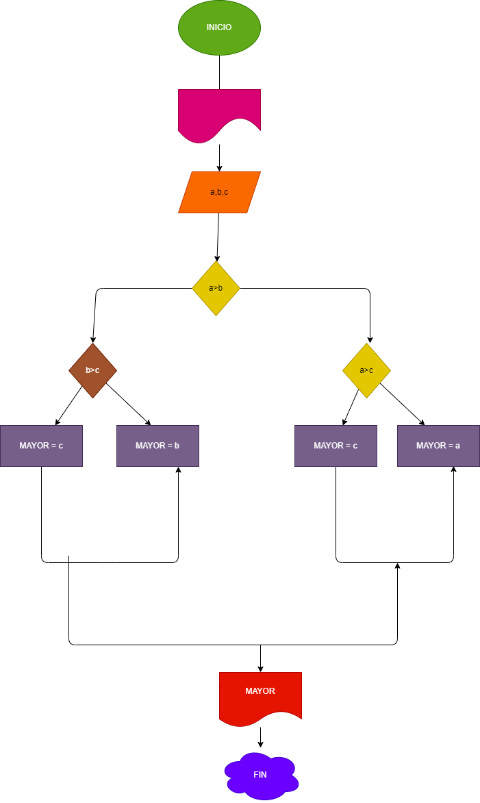

## EJERCICIO 2 ESTRUCTURAS CONDICIONALES 

## Programa para hallar el mayor de tres numeros enteros

## Analisis 

### definicion de variables

* a: primer numero
* b: seegundo numero 
* b: Tercer  numero 
* mayor: numero mayor

se compara los tres valores entre si 

## Diseño 

